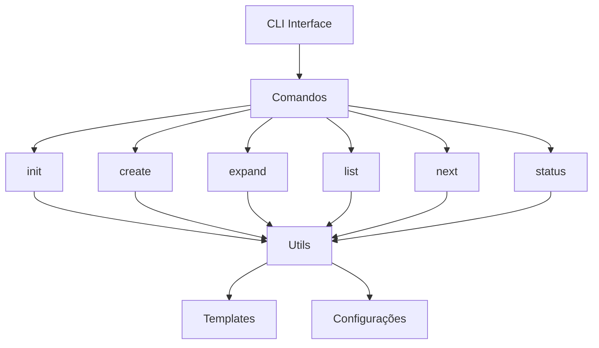
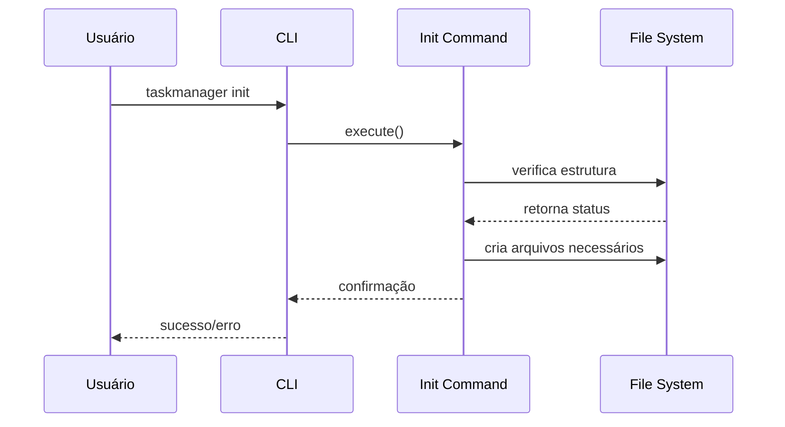
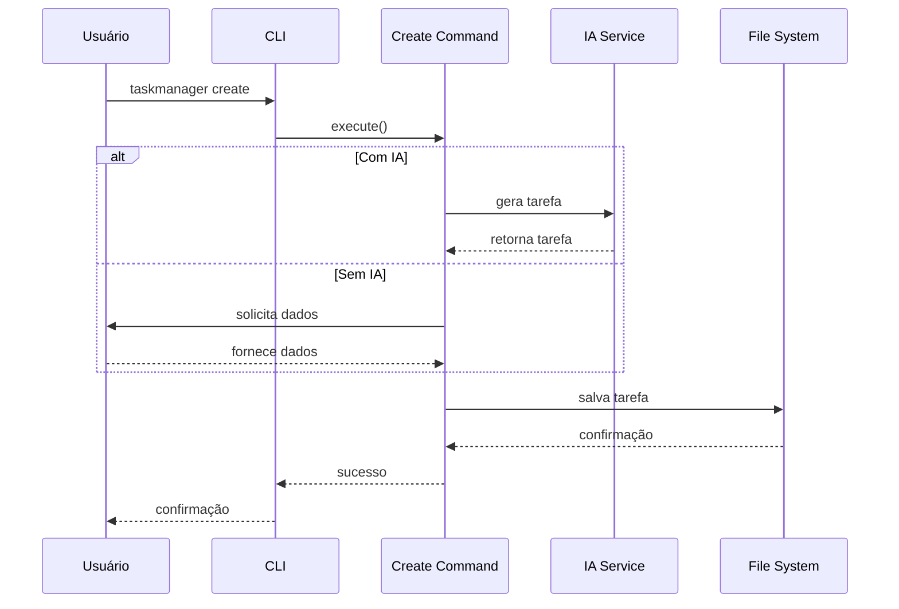

# TaskManager - Diagramas e Fluxos

## Diagrama de Arquitetura



## Fluxo de Execução

### Fluxo de Inicialização


### Fluxo de Criação de Tarefa


## Estrutura de Dados

### Tarefa
```json
{
    "id": "string",
    "title": "string",
    "description": "string",
    "priority": "high|medium|low",
    "status": "pending|in-progress|done",
    "created_at": "timestamp",
    "updated_at": "timestamp",
    "subtasks": ["array of task ids"],
    "parent_task": "task id or null"
}
```

## Relações entre Componentes

1. **CLI Interface**
   - Gerencia a interação com o usuário
   - Roteia comandos para os respectivos handlers
   - Formata a saída para o terminal

2. **Comandos**
   - Implementam a lógica específica de cada comando
   - Utilizam serviços utilitários
   - Interagem com o sistema de arquivos

3. **Utils**
   - Fornecem funcionalidades compartilhadas
   - Gerenciam configurações
   - Implementam lógica de negócio comum

4. **Templates**
   - Armazenam modelos para geração de tarefas
   - Definem estruturas padrão
   - Facilitam a criação consistente de tarefas

## Fluxo de Dados

1. **Entrada**
   - Comandos do usuário via terminal
   - Arquivos de configuração
   - Templates

2. **Processamento**
   - Validação de entrada
   - Geração de conteúdo (opcionalmente com IA)
   - Manipulação de dados

3. **Saída**
   - Arquivos de tarefas
   - Feedback no terminal
   - Logs de operação
